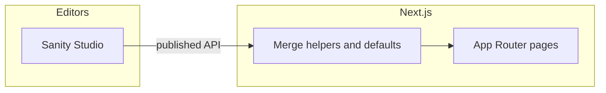

# Architecture

High-level map of the **scph-website** codebase: two marketing surfaces in one Next.js app, with most copy in Sanity.

## Stack

- **Framework:** Next.js (App Router), React, TypeScript.
- **Styling:** Tailwind CSS v4-style pipeline (`@import "tailwindcss"` in `src/app/globals.css`), shadcn/tailwind presets, shared tokens in `@theme inline`.
- **CMS:** Sanity (`studio/`). Runtime reads the **published** dataset via `src/sanity/client.ts` and GROQ-backed modules (`src/sanity/*.ts`).

## Routes and layouts

| Area | App directory | URLs |
|------|---------------|------|
| SCPH marketing | `src/app/(scph)/` | `/`, `/about-us`, `/programmes`, `/research`, `/events`, `/media`, `/network`, `/projects` |
| GTP 2026 event | `src/app/events/gtp-2026/` | `/events/gtp-2026/*` (about, programmes, submissions, FAQ, get-involved, media, biz-forum, organising-committee) |

The `(scph)` segment is a **route group**: it organizes files without adding a URL segment.

Shared chrome:

- Root: `src/app/layout.tsx`, `src/app/globals.css`.
- SCPH: `src/app/(scph)/layout.tsx`.
- GTP: `src/app/events/gtp-2026/layout.tsx`.

**Indexable paths** used for sitemap (and related tooling) are listed in `src/lib/public-indexable-paths.ts` (`ALL_PUBLIC_INDEXABLE_PATHS`).

## Content flow (Sanity)

1. Editors author and **publish** in Sanity Studio (`studio/`).
2. Next.js fetches with the Sanity client and GROQ (see `src/sanity/queries.ts`, `gtp-stage1.ts`, `gtp-stage2.ts`, and similar).
3. Many pages **merge** API results with **code defaults** (`mergeGtp*`, `mergeScph*`, `src/data/*`, `src/sanity/gtp-marketing-defaults.ts`). Published CMS values win over empty fields; changing code defaults does not overwrite populated Studio fields.

Structured page sections often use the shared block renderer:

- `src/components/sections/render-section-block.tsx`

For the full CMS checklist (schema, seeds, revalidation, sitemap, handbook), see **§3–4** in [AGENTS.md](../AGENTS.md).

## Component layout

Prefer colocating UI under `src/components/`:

- `gtp/` — GTP-specific sections and chrome.
- `scph/` — SCPH-specific sections and shared pieces (e.g. handbook).
- `sections/` — Generic section blocks and `render-section-block`.
- `ui/` — Reusable primitives (shadcn-style).

## Redirects and config

- Redirects: `next.config.ts` (e.g. external registration URL for GTP).
- Images / CDN: `next.config.ts` → `images.remotePatterns` (Sanity CDN, etc.).

## See also

- [AGENTS.md](../AGENTS.md) — CMS ownership, seeds, performance.
- [coding-guidelines.md](./coding-guidelines.md) — Server Components, imports, TypeScript boundaries.
